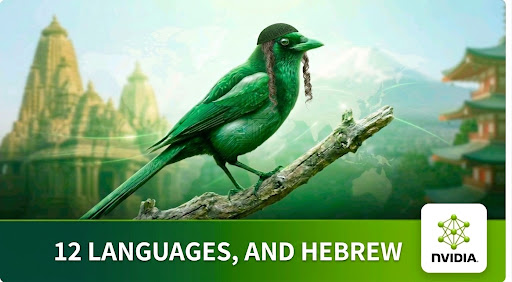

# MagpieTTS Multilingual 357M — Hebrew Fine-tuning



Fine-tunes [nvidia/magpie_tts_multilingual_357m](https://huggingface.co/nvidia/magpie_tts_multilingual_357m)
on Hebrew using **IPA phoneme input**, following NeMo's
["adding a new language" recipe](https://docs.nvidia.com/nemo/speech/nightly/tts/magpietts-finetuning.html).

Trained model: LoRA fine-tune, **110,000 steps, val_loss 9.345**, on 2× RTX 5090.

## Approach

- **Model**: 357M encoder-decoder transformer (NeMo MagpieTTS), NanoCodec @ 22.05 kHz,
  voice cloning from a 10 s context clip.
- **Hebrew input = IPA**. The training CSVs contain stress-marked IPA
  (e.g. `ʔanˈaχnu beʔˈad sifʁijˈa leʔumˈit.`), which is fed directly as `text` —
  no G2P runs at train or inference time, you always pass IPA.
  Hebrew is a new language for this model, so a 16th tokenizer
  (`hebrew_chartokenizer`) is appended to the checkpoint's existing 15, and the
  text-embedding table is padded with 33 fresh rows. Appending last preserves
  every pretrained token-ID offset.
- **Tokenizer: one token per IPA symbol** (33-symbol vocabulary), not byte-level.
  This matches how the base model tokenizes its 8 other IPA languages; byt5 is what
  NVIDIA uses for orthographic text (French, Italian, Korean). Implemented as NeMo's
  `BaseCharsTokenizer` parameterized with the Hebrew IPA charset — NeMo blocks
  instantiation of targets outside its own namespace, so a custom subclass will not load.
- **Data**: 15 Hebrew datasets, ~778k utterances / ~1,079 hours, from
  `/home/maxm/AE_training_data_all` — 3 Knesset voices (`generated_audio/voice{1,2,3}_high_quality`)
  plus 12 `slow_44K` speakers. Filtered by `passed_filter` + whisper WER ≤ 0.2, and by
  charset (283 utterances dropped for mojibake / foreign-script leakage).
  NeMo resamples 44.1 kHz → 22.05 kHz on the fly.
- **Context pairing**: each utterance gets a random same-voice utterance (≥ 5 s) as its
  voice-cloning reference (`context_audio_filepath` / `context_text` / `context_audio_duration`).

## Usage

```bash
# 1. env + NeMo + checkpoint (downloads ~1.5 GB)
bash scripts/setup.sh

# 2. build train/val manifests (CPU only; reads ~1.1M wav headers)
venv/bin/python scripts/build_manifests.py

# 3. train (both GPUs by default)
bash scripts/train_hebrew.sh
#   single GPU:  GPU=1 bash scripts/train_hebrew.sh
#   overrides:   BATCH_SIZE=8 LR=1e-4 MAX_EPOCHS=100 STEPS_PER_EPOCH=2000 LORA_R=16
#   extra hydra overrides pass through: bash scripts/train_hebrew.sh trainer.log_every_n_steps=10

# 4. fold LoRA into the base weights for inference
venv/bin/python scripts/merge_lora.py \
  --ckpt experiments/Magpie-TTS/checkpoints/<best>.ckpt --out merged.ckpt

# 5. synthesize (IPA in, wav out)
venv/bin/python scripts/infer_hebrew.py \
  --checkpoint merged.ckpt \
  --hparams   experiments/Magpie-TTS/version_0/hparams.yaml \
  --context-audio /home/maxm/AE_training_data_all/generated_audio/voice1_high_quality/voice1_knesset_007634.wav \
  --context-text "<IPA of the context clip>" \
  --text "ʔanˈaχnu beʔˈad sifʁijˈa leʔumˈit." \
  --out-dir outputs/test1
```

**Inference quality flags matter.** NeMo's inference script defaults classifier-free
guidance and the local transformer (multi-codebook refinement) to *off*, even though
both are trained. `infer_hebrew.py` turns both **on by default** — A/B testing showed
each audibly reduces robotic artifacts. Disable with `--no-use-cfg` /
`--no-use-local-transformer`.

## LoRA

NeMo MagpieTTS has no built-in PEFT, so `scripts/magpietts_lora.py` implements it:
adapters (default r=16, α=32) are injected into the attention projections
(`qkv_net`, `o_net`, `q_net`, `kv_net`) of the encoder/decoder/local transformer —
78 adapters, ~5.5M of 375M params trainable (1.5%). Everything else is frozen
**except the text embeddings**, which must train because the Hebrew tokens are new.

It also rebuilds the model config from the checkpoint's own `model_config.yaml` rather
than the stock YAML — the released checkpoint uses frame stacking (factor 2) and a
different codebook layout, and the stock config will not load into it. Frame stacking
is also why `context_duration_{min,max}` must be ≥ 10 s.

Tune via env (`LORA_R`, `LORA_ALPHA`) or hydra (`+lora.dropout=0.05`,
`"+lora.targets=[...]"`). `scripts/ds_meta_args.py` generates per-dataset hydra
overrides from `data/manifests/datasets.json`.

## Key hyperparameters

| setting | value | why |
|---|---|---|
| `model.optim.lr` | `1e-4`, no schedule | LoRA LR (use `1e-5` for a full fine-tune) |
| `model.alignment_loss_scale` / `prior_scaling_factor` | `0.0` / `null` | alignment prior over-constrains fine-tuning |
| `trainer.precision` | `32` | fine-tuning stability |
| `model.context_duration_{min,max}` | `10.0` | required by frame stacking factor 2 |
| `weighted_sampling_steps_per_epoch` | `2000` | balanced sampling across 15 uneven datasets |
| `batch_size` | `8` per GPU | fp32 on a 32 GB RTX 5090 |

## Evaluation — ILSpeech held-out test set

[Phonikud/ILSpeech](https://huggingface.co/datasets/Phonikud/ILSpeech) v2 is real
recorded Hebrew from two speakers with gold IPA, and neither speaker appears in
our training data — so its 150-utterance test split is a genuine zero-shot
benchmark rather than a rerun of the training distribution.

```bash
# fetch + extract ilspeech-v2.7z into data/ilspeech/, then:
venv/bin/python scripts/build_ilspeech_eval.py
venv/bin/python scripts/infer_hebrew.py \
  --checkpoint experiments/magpie_hebrew_final.ckpt \
  --hparams   experiments/magpie_hebrew_final.hparams.yaml \
  --manifest  data/ilspeech/eval/eval_manifest.json \
  --audio-dir data/ilspeech/ilspeech-v2/wav \
  --out-dir   outputs/ilspeech_eval --extra --batch_size 4
venv/bin/python scripts/score_ilspeech.py \
  --pred-dir outputs/ilspeech_eval/<run>/audio/repeat_0
```

Every metric is reported next to the same metric measured on the **real
recordings**, because the ASR models have their own error rate and without that
column you cannot tell a synthesis error from a transcription error.

| metric | synthesized | real recordings |
|---|---|---|
| Hebrew WER (`ivrit-ai/whisper-large-v3-turbo`) | **9.0%** | 8.6% |
| Hebrew CER | **4.6%** | 4.5% |
| IPA PER (`notmax123/whisper-he-ipa`) | **1.1%** | 2.2% |
| duration vs ground truth | 1.03× | 1.00 |

**Intelligibility is at the measurement ceiling.** WER and CER are within 0.4
points of real human recordings of the same sentences, and phoneme error is
*lower* than on the real audio — the model articulates the IPA it is given more
canonically than the speakers themselves do. Pace also tracks the recordings
(1.03×). Reading Hebrew IPA works.

Two notes on making these numbers mean anything. `notmax123/whisper-he-ipa`
emits an ASCII transliteration (`q`=ʔ, `S`=ʃ, `x`=χ, `g`=ɡ, `r`=ʁ), so scoring
it directly against gold IPA reports ~37% PER on *real recordings* — pure symbol
mismatch. `scripts/score_ilspeech.py` maps the alphabet first. Only 2 of 150 test
utterances contain IPA outside the model's 27-symbol vocabulary (`w` in
loanwords, mapped to `v`), and no test wav reaches the 10 s context length frame
stacking requires, so the voice reference is built by concatenating *train*-split
utterances of the same speaker.

### Voice cloning does not work

| TitaNet cosine similarity | value |
|---|---|
| real speaker vs itself | 0.66 – 0.81 |
| real speaker vs a different speaker | 0.00 – 0.23 |
| generated vs its target speaker (unseen) | **0.21** |
| generated vs its target speaker (a *training* voice) | **0.37** |
| generated vs generated, *different reference clips* | **0.35** |
| generated vs generated, same reference | 0.34 |

The last two rows are the finding: swapping the reference clip changes the output
no more than resynthesizing the same reference does. The model emits one diffuse
average voice regardless of what it is conditioned on, and it does so even for a
voice it trained on — so this is not a generalization gap, it is speaker
conditioning that stopped functioning. Disabling CFG makes it slightly worse
(0.31), so guidance is not the cause.

Reproduce with `scripts/diagnose_speaker_conditioning.py`, which always prints
the same-speaker and different-speaker anchors, since a bare similarity number
carries no scale.

The likely cause is the fine-tuning setup rather than the recipe: 15 speakers,
all synthetic and each internally very uniform, with LoRA on every attention
projection including the context cross-attention. Ignoring the reference and
predicting the corpus-average voice is a low-loss shortcut under that data.
Worth trying before anything else: freeze the context encoder and its
cross-attention (drop them from `+lora.targets`), and add speaker diversity.

## Results and limitations

Validation loss converged well before the configured 200k steps:

| step | val_loss |
|---|---|
| 2,000 | 10.054 |
| 8,000 | 9.676 |
| 40,000 | 9.436 |
| 90,000 | 9.361 |
| 110,000 | 9.345 |

Gains per 10k steps fell from −0.20 early to −0.003 by step 90k. **More steps are not
the lever** past roughly 50k.

The remaining naturalness ceiling comes from the training data, which is synthetic:
noise floors measure 0.0001–0.0004 with near-zero variance across files (digital
silence, not recorded rooms), the audio lives under `generated_audio/`, and the CSVs
carry an `original_phonemes → whisper_phonemes → wer_score` synthesize-then-ASR-verify
structure. Training on TTS output caps naturalness near the teacher system's.
`slow_44K` is additionally time-stretched (`atempo=0.85` per `resample_and_slow.py`),
though measured speaking rates end up within 4% of the Knesset voices (15.13 vs
15.76 phonemes/sec), so the stretch matters less than it first appears.

**To improve further, add real recorded Hebrew** and weight it heavily via
`sample_weight`. Re-weighting between existing sources will not help — they share the
same synthetic ceiling.

## Notes

- Monitor `experiments/` with TensorBoard.
- Pure-Hebrew fine-tuning degrades the model's original 12 languages. To preserve them,
  mix in original-language data (e.g. HiFiTTS under `datasets_4AE_extracted/`) as extra
  `train_ds_meta` entries using the built-in tokenizers.
- Codec codes are computed on the fly. To speed up epochs, pre-extract codes and add
  `target_audio_codes_path` / `context_audio_codes_path` to the manifests
  (`model.load_cached_codes_if_available=true` is already set).
